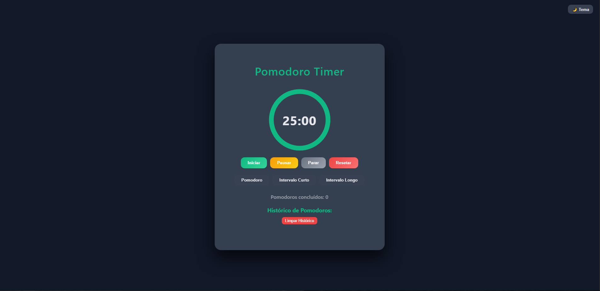
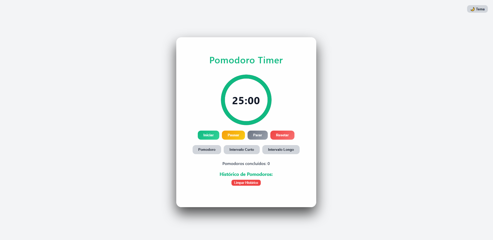

# 🍅 Pomodoro Timer


## 💻 Preview




Um cronômetro de produtividade moderno e funcional baseado na **Técnica Pomodoro**. O projeto foca em uma interface minimalista com elementos visuais de progresso, sistema de histórico e notificações para otimizar o fluxo de trabalho.

---

## 🚀 Tecnologias

Este projeto foi desenvolvido utilizando o "trio de ouro" do desenvolvimento web:

- **HTML5:** Estruturação semântica e elementos SVG para o círculo de progresso.
- **CSS3:** Estilização moderna com variáveis (Custom Properties), Flexbox, efeitos de Glassmorphism e suporte nativo a **Dark/Light Mode**.
- **JavaScript (ES6+):** Lógica de temporização, manipulação de API de áudio, Web Notifications e persistência de dados.

## ✨ Funcionalidades

- [x] **Timer Interativo:** Círculo de progresso animado que diminui conforme o tempo passa.
- [x] **Configurações Rápidas:** Botões para Pomodoro (25 min), Intervalo Curto (5 min) e Intervalo Longo (15 min).
- [x] **Modo Escuro/Claro:** Alternância de tema com preservação visual elegante.
- [x] **Histórico Persistente:** Grava automaticamente a conclusão ou interrupção de ciclos no `localStorage`.
- [x] **Sistema de Notificações:** Alertas visuais no navegador e sinal sonoro ao finalizar um ciclo.
- [x] **Gerenciamento de Logs:** Possibilidade de excluir entradas individuais ou limpar todo o histórico.
- [x] **Contador de Ciclos:** Exibição do total de Pomodoros concluídos na sessão.

## 🛠️ Como usar o projeto

1. **Clone o repositório:**

   ```bash
   git clone [https://github.com/alison-souza/pomodoro-timer.git](https://github.com/alison-souza/pomodoro-timer.git)
   ```

2. **Acesse a pasta:**

   ```bash
   cd pomodoro-timer
   ```

3. **Execução: Basta abrir o arquivo index.html em seu navegador de preferência.**

## 📂 Estrutura do Projeto

```text
pomodoro-timer/
├── icons/
│ └── clock.png
├── index.html
├── style.css
├── script.js
└── README.md
```

## ⚙️ Detalhes Técnicos

LocalStorage: O contador de Pomodoros e o histórico de atividades permanecem salvos mesmo após fechar o navegador.

---

Web Audio: Utiliza a tag <audio> para feedback sonoro imediato.

---

Calculo de SVG: O círculo de progresso utiliza a propriedade stroke-dashoffset calculada dinamicamente via JS:$circumference = 2 * \pi * radius$
